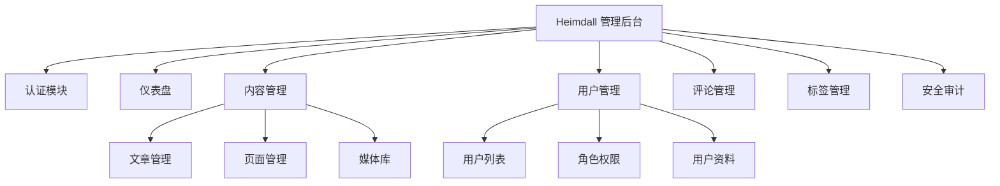

# Heimdall 管理后台前端 - 综合设计文档

> **设计目标**: 基于成熟组件库，快速构建高质量、可维护的博客管理后台

## 📋 目录

1. [项目概述](#1-项目概述)
2. [技术栈选型](#2-技术栈选型)
3. [架构设计](#3-架构设计)
4. [组件库整合方案](#4-组件库整合方案)
5. [状态管理设计](#5-状态管理设计)
6. [API 集成策略](#6-api-集成策略)
7. [安全性设计](#7-安全性设计)
8. [性能优化方案](#8-性能优化方案)
9. [开发规范](#9-开发规范)
10. [快速开发指南](#10-快速开发指南)
11. [部署策略](#11-部署策略)

---

## 1. 项目概述

### 1.1 项目定位

`heimdall-web` 是 Heimdall 博客生态系统的管理后台，专注于为内容创作者提供高效、直观的管理界面。

**核心目标**:
- ⚡ **快速开发**: 基于成熟组件库，减少 80% 的UI开发时间
- 🎯 **用户体验**: 现代化、响应式的管理界面
- 🔒 **企业级**: 完善的权限控制和安全机制
- 🚀 **高性能**: 优化的加载速度和交互体验

### 1.2 功能模块



---

## 2. 技术栈选型

### 2.1 核心技术栈（优化版）

```typescript
// 基础框架
const techStack = {
  // 核心框架
  framework: 'Next.js 14+',
  language: 'TypeScript 5.0+',
  packageManager: 'pnpm', // 统一使用 pnpm
  
  // UI 组件库（重点优化）
  uiLibrary: {
    primary: '@mantine/core', // 主要组件库
    secondary: 'shadcn/ui',   // 补充组件
    icons: '@tabler/icons-react',
    styling: 'Tailwind CSS + CSS Modules'
  },
  
  // 状态管理
  stateManagement: {
    server: '@tanstack/react-query',
    client: 'zustand',
    forms: 'react-hook-form + zod'
  },
  
  // 编辑器
  editor: '@mantine/tiptap', // 基于 Tiptap 的成熟编辑器
  
  // 工具库
  utilities: {
    dateTime: 'dayjs',
    validation: 'zod',
    notifications: '@mantine/notifications',
    modals: '@mantine/modals',
    http: 'axios',
    charts: 'recharts'
  }
};
```

### 2.2 选择 Mantine 的原因

**为什么选择 Mantine 作为主要组件库**:

1. **完整性**: 提供 100+ 高质量组件，覆盖所有管理后台需求
2. **成熟度**: 生产环境验证，文档完善，社区活跃
3. **定制性**: 强大的主题系统，支持深度定制
4. **开发效率**: 开箱即用的复杂组件（表格、表单、图表等）
5. **TypeScript**: 完整的 TypeScript 支持
6. **生态**: 丰富的扩展包（日期选择器、富文本编辑器等）

### 2.3 依赖包列表

```json
{
  "dependencies": {
    // 核心框架
    "next": "^14.0.0",
    "react": "^18.0.0",
    "react-dom": "^18.0.0",
    "typescript": "^5.0.0",
    
    // Mantine 生态
    "@mantine/core": "^7.0.0",
    "@mantine/hooks": "^7.0.0",
    "@mantine/form": "^7.0.0",
    "@mantine/notifications": "^7.0.0",
    "@mantine/modals": "^7.0.0",
    "@mantine/dropzone": "^7.0.0",
    "@mantine/dates": "^7.0.0",
    "@mantine/tiptap": "^7.0.0",
    "@tabler/icons-react": "^2.0.0",
    
    // 状态管理
    "@tanstack/react-query": "^5.0.0",
    "zustand": "^4.0.0",
    
    // 表单验证
    "react-hook-form": "^7.0.0",
    "zod": "^3.0.0",
    "@hookform/resolvers": "^3.0.0",
    
    // 工具库
    "axios": "^1.0.0",
    "dayjs": "^1.0.0",
    "recharts": "^2.0.0",
    "react-markdown": "^9.0.0",
    
    // 编辑器
    "@tiptap/react": "^2.0.0",
    "@tiptap/starter-kit": "^2.0.0",
    "@tiptap/extension-link": "^2.0.0",
    "@tiptap/extension-image": "^2.0.0",
    "@tiptap/extension-code-block-lowlight": "^2.0.0"
  },
  "devDependencies": {
    // 开发工具
    "eslint": "^8.0.0",
    "prettier": "^3.0.0",
    "husky": "^8.0.0",
    "lint-staged": "^15.0.0",
    
    // 测试
    "@testing-library/react": "^14.0.0",
    "@testing-library/jest-dom": "^6.0.0",
    "jest": "^29.0.0",
    "jest-environment-jsdom": "^29.0.0"
  }
}
```

---

## 3. 架构设计

### 3.1 目录结构（优化版）

```
heimdall-web/
├── package.json
├── pnpm-lock.yaml
├── next.config.js
├── tailwind.config.js
├── tsconfig.json
├── .eslintrc.json
├── .prettierrc
├── 
├── src/
│   ├── app/                          # Next.js App Router
│   │   ├── (auth)/                   # 认证路由组
│   │   │   └── login/
│   │   ├── (dashboard)/              # 管理后台路由组
│   │   │   ├── dashboard/
│   │   │   ├── posts/
│   │   │   ├── pages/
│   │   │   ├── comments/
│   │   │   ├── tags/
│   │   │   ├── users/
│   │   │   └── security/
│   │   ├── globals.css
│   │   ├── layout.tsx
│   │   └── providers.tsx
│   │
│   ├── components/                   # 组件库
│   │   ├── ui/                       # 基础UI组件
│   │   │   ├── Button/
│   │   │   ├── Input/
│   │   │   ├── Table/
│   │   │   └── index.ts
│   │   ├── layout/                   # 布局组件
│   │   │   ├── AdminLayout/
│   │   │   ├── Sidebar/
│   │   │   ├── Header/
│   │   │   └── index.ts
│   │   ├── forms/                    # 表单组件
│   │   │   ├── PostForm/
│   │   │   ├── UserForm/
│   │   │   └── index.ts
│   │   ├── features/                 # 功能组件
│   │   │   ├── PostEditor/
│   │   │   ├── CommentList/
│   │   │   ├── UserTable/
│   │   │   └── index.ts
│   │   └── shared/                   # 共享组件
│   │       ├── LoadingSpinner/
│   │       ├── ErrorBoundary/
│   │       └── index.ts
│   │
│   ├── lib/                          # 工具库
│   │   ├── api/                      # API客户端
│   │   │   ├── client.ts
│   │   │   ├── endpoints/
│   │   │   │   ├── auth.ts
│   │   │   │   ├── posts.ts
│   │   │   │   ├── users.ts
│   │   │   │   └── index.ts
│   │   │   └── types.ts
│   │   ├── auth/                     # 认证逻辑
│   │   │   ├── provider.tsx
│   │   │   ├── guards.tsx
│   │   │   └── utils.ts
│   │   ├── utils/                    # 工具函数
│   │   │   ├── format.ts
│   │   │   ├── validation.ts
│   │   │   ├── storage.ts
│   │   │   └── index.ts
│   │   ├── hooks/                    # 自定义Hooks
│   │   │   ├── useAuth.ts
│   │   │   ├── usePermissions.ts
│   │   │   ├── usePagination.ts
│   │   │   └── index.ts
│   │   └── constants/                # 常量定义
│   │       ├── api.ts
│   │       ├── permissions.ts
│   │       ├── routes.ts
│   │       └── index.ts
│   │
│   ├── stores/                       # 状态管理
│   │   ├── auth.ts
│   │   ├── theme.ts
│   │   ├── ui.ts
│   │   └── index.ts
│   │
│   ├── types/                        # TypeScript类型
│   │   ├── api.ts
│   │   ├── auth.ts
│   │   ├── post.ts
│   │   ├── user.ts
│   │   └── index.ts
│   │
│   └── styles/                       # 样式文件
│       ├── globals.css
│       ├── components.css
│       └── utilities.css
│
├── public/                           # 静态资源
│   ├── images/
│   ├── icons/
│   └── favicon.ico
│
├── docs/                            # 文档
│   ├── API.md
│   ├── DEPLOYMENT.md
│   └── DEVELOPMENT.md
│
└── tests/                           # 测试文件
    ├── __mocks__/
    ├── components/
    ├── hooks/
    └── utils/
```

### 3.2 模块职责划分

```typescript
// 模块职责清单
interface ModuleResponsibility {
  app: '路由和页面组件';
  components: 'UI组件、布局组件、功能组件';
  lib: 'API客户端、认证逻辑、工具函数、自定义Hooks';
  stores: '全局状态管理';
  types: 'TypeScript类型定义';
  styles: '全局样式和主题';
}
```

---

## 4. 组件库整合方案

### 4.1 Mantine 主题配置

```typescript
// src/lib/theme/mantine.ts
import { createTheme, MantineColorsTuple } from '@mantine/core';

const primaryColor: MantineColorsTuple = [
  '#f0f9ff',
  '#e0f2fe',
  '#bae6fd',
  '#7dd3fc',
  '#38bdf8',
  '#0ea5e9', // 主色调
  '#0284c7',
  '#0369a1',
  '#075985',
  '#0c4a6e'
];

export const mantineTheme = createTheme({
  primaryColor: 'blue',
  colors: {
    blue: primaryColor,
  },
  fontFamily: 'Inter, -apple-system, BlinkMacSystemFont, sans-serif',
  fontFamilyMonospace: 'JetBrains Mono, Monaco, Courier New, monospace',
  
  // 自定义组件样式
  components: {
    Button: {
      defaultProps: {
        radius: 'md',
      },
    },
    Paper: {
      defaultProps: {
        shadow: 'sm',
        radius: 'md',
      },
    },
    Table: {
      defaultProps: {
        highlightOnHover: true,
        striped: true,
      },
    },
  },
  
  // 响应式断点
  breakpoints: {
    xs: '36em',
    sm: '48em',
    md: '62em',
    lg: '75em',
    xl: '88em',
  },
});
```

### 4.2 组件封装策略

```typescript
// src/components/ui/Button/index.tsx
import { Button as MantineButton, ButtonProps } from '@mantine/core';
import { forwardRef } from 'react';

interface CustomButtonProps extends ButtonProps {
  loading?: boolean;
  icon?: React.ReactNode;
}

export const Button = forwardRef<HTMLButtonElement, CustomButtonProps>(
  ({ loading, icon, children, ...props }, ref) => {
    return (
      <MantineButton
        ref={ref}
        loading={loading}
        leftSection={icon}
        {...props}
      >
        {children}
      </MantineButton>
    );
  }
);

Button.displayName = 'Button';
```

### 4.3 常用组件清单

```typescript
// 基于 Mantine 的组件清单
export const ComponentLibrary = {
  // 基础组件
  layout: [
    'AppShell',     // 应用布局
    'Container',    // 容器
    'Grid',         // 网格
    'Stack',        // 垂直堆叠
    'Group',        // 水平分组
    'Paper',        // 纸张容器
  ],
  
  // 表单组件
  forms: [
    'TextInput',    // 文本输入
    'Textarea',     // 多行文本
    'Select',       // 下拉选择
    'MultiSelect',  // 多选
    'DatePicker',   // 日期选择器
    'Switch',       // 开关
    'Checkbox',     // 复选框
    'Radio',        // 单选按钮
  ],
  
  // 数据展示
  dataDisplay: [
    'Table',        // 表格
    'Card',         // 卡片
    'Badge',        // 徽章
    'Avatar',       // 头像
    'Timeline',     // 时间线
    'Stats',        // 统计数字
  ],
  
  // 导航组件
  navigation: [
    'Tabs',         // 选项卡
    'Breadcrumbs',  // 面包屑
    'Pagination',   // 分页
    'Stepper',      // 步骤器
  ],
  
  // 反馈组件
  feedback: [
    'Modal',        // 模态框
    'Drawer',       // 抽屉
    'Notifications', // 通知
    'LoadingOverlay', // 加载覆盖
    'Progress',     // 进度条
  ],
  
  // 富文本编辑器
  editor: [
    'RichTextEditor', // Mantine Tiptap 编辑器
  ]
};
```

---

## 5. 状态管理设计

### 5.1 状态分层架构

```typescript
// 状态管理分层
interface StateArchitecture {
  // 本地状态 - React useState/useReducer
  local: {
    formData: '表单输入状态';
    uiState: 'UI交互状态（展开/收起等）';
    tempData: '临时数据';
  };
  
  // 全局客户端状态 - Zustand
  global: {
    auth: '用户认证信息';
    theme: '主题设置';
    preferences: '用户偏好设置';
    ui: '全局UI状态';
  };
  
  // 服务器状态 - React Query
  server: {
    posts: '文章数据';
    users: '用户数据';
    comments: '评论数据';
    tags: '标签数据';
  };
}
```

### 5.2 Zustand Store 设计

```typescript
// src/stores/auth.ts
import { create } from 'zustand';
import { persist } from 'zustand/middleware';

interface User {
  id: string;
  username: string;
  displayName: string;
  email: string;
  role: 'admin' | 'editor' | 'author';
  profileImage: string;
  permissions: string[];
}

interface AuthStore {
  // 状态
  user: User | null;
  token: string | null;
  refreshToken: string | null;
  isAuthenticated: boolean;
  isLoading: boolean;
  
  // 操作
  login: (credentials: LoginData) => Promise<void>;
  logout: () => void;
  refreshAuth: () => Promise<void>;
  setUser: (user: User) => void;
  checkPermission: (permission: string) => boolean;
}

export const useAuthStore = create<AuthStore>()(
  persist(
    (set, get) => ({
      // 初始状态
      user: null,
      token: null,
      refreshToken: null,
      isAuthenticated: false,
      isLoading: false,
      
      // 登录操作
      login: async (credentials) => {
        set({ isLoading: true });
        try {
          const response = await authApi.login(credentials);
          const { user, token, refreshToken } = response.data;
          
          set({
            user,
            token,
            refreshToken,
            isAuthenticated: true,
            isLoading: false,
          });
        } catch (error) {
          set({ isLoading: false });
          throw error;
        }
      },
      
      // 登出操作
      logout: () => {
        set({
          user: null,
          token: null,
          refreshToken: null,
          isAuthenticated: false,
        });
      },
      
      // 刷新认证
      refreshAuth: async () => {
        const { refreshToken } = get();
        if (!refreshToken) throw new Error('No refresh token');
        
        try {
          const response = await authApi.refresh({ refreshToken });
          const { user, token, refreshToken: newRefreshToken } = response.data;
          
          set({
            user,
            token,
            refreshToken: newRefreshToken,
            isAuthenticated: true,
          });
        } catch (error) {
          get().logout();
          throw error;
        }
      },
      
      // 设置用户信息
      setUser: (user) => set({ user }),
      
      // 权限检查
      checkPermission: (permission) => {
        const { user } = get();
        return user?.permissions.includes(permission) || false;
      },
    }),
    {
      name: 'auth-storage',
      partialize: (state) => ({
        user: state.user,
        token: state.token,
        refreshToken: state.refreshToken,
        isAuthenticated: state.isAuthenticated,
      }),
    }
  )
);
```

### 5.3 React Query 配置

```typescript
// src/lib/query/client.ts
import { QueryClient } from '@tanstack/react-query';

export const queryClient = new QueryClient({
  defaultOptions: {
    queries: {
      staleTime: 5 * 60 * 1000, // 5分钟
      cacheTime: 10 * 60 * 1000, // 10分钟
      retry: (failureCount, error: any) => {
        // 不重试认证错误
        if (error?.response?.status === 401) return false;
        return failureCount < 3;
      },
      refetchOnWindowFocus: false,
    },
    mutations: {
      retry: false,
    },
  },
});

// src/lib/hooks/usePosts.ts
import { useQuery, useMutation, useQueryClient } from '@tanstack/react-query';
import { postsApi } from '@/lib/api';

export const usePosts = (params: PostQuery) => {
  return useQuery({
    queryKey: ['posts', params],
    queryFn: () => postsApi.getList(params),
    keepPreviousData: true,
  });
};

export const useCreatePost = () => {
  const queryClient = useQueryClient();
  
  return useMutation({
    mutationFn: postsApi.create,
    onSuccess: () => {
      // 刷新文章列表
      queryClient.invalidateQueries({ queryKey: ['posts'] });
    },
  });
};
```

---

## 6. API 集成策略

### 6.1 API 客户端设计

```typescript
// src/lib/api/client.ts
import axios, { AxiosInstance, AxiosRequestConfig } from 'axios';
import { useAuthStore } from '@/stores/auth';

class ApiClient {
  private client: AxiosInstance;
  
  constructor(baseURL: string) {
    this.client = axios.create({
      baseURL,
      timeout: 30000,
      headers: {
        'Content-Type': 'application/json',
      },
    });
    
    this.setupInterceptors();
  }
  
  private setupInterceptors() {
    // 请求拦截器 - 添加认证token
    this.client.interceptors.request.use(
      (config) => {
        const { token } = useAuthStore.getState();
        if (token) {
          config.headers.Authorization = `Bearer ${token}`;
        }
        return config;
      },
      (error) => Promise.reject(error)
    );
    
    // 响应拦截器 - 处理错误和token刷新
    this.client.interceptors.response.use(
      (response) => response,
      async (error) => {
        const originalRequest = error.config;
        
        if (error.response?.status === 401 && !originalRequest._retry) {
          originalRequest._retry = true;
          
          try {
            await useAuthStore.getState().refreshAuth();
            return this.client(originalRequest);
          } catch (refreshError) {
            useAuthStore.getState().logout();
            window.location.href = '/login';
            return Promise.reject(refreshError);
          }
        }
        
        return Promise.reject(error);
      }
    );
  }
  
  // HTTP方法封装
  async get<T>(url: string, params?: any): Promise<ApiResponse<T>> {
    const response = await this.client.get(url, { params });
    return response.data;
  }
  
  async post<T>(url: string, data?: any): Promise<ApiResponse<T>> {
    const response = await this.client.post(url, data);
    return response.data;
  }
  
  async put<T>(url: string, data?: any): Promise<ApiResponse<T>> {
    const response = await this.client.put(url, data);
    return response.data;
  }
  
  async delete<T>(url: string): Promise<ApiResponse<T>> {
    const response = await this.client.delete(url);
    return response.data;
  }
}

export const apiClient = new ApiClient(
  process.env.NEXT_PUBLIC_API_URL || 'http://localhost:8080'
);
```

### 6.2 错误处理策略

```typescript
// src/lib/api/errors.ts
import { notifications } from '@mantine/notifications';

export interface ApiError {
  code: number;
  message: string;
  details?: Record<string, any>;
  timestamp: string;
}

export const errorHandler = {
  handle: (error: any) => {
    if (error.response?.data) {
      const apiError: ApiError = error.response.data;
      
      switch (apiError.code) {
        case 1001: // 业务错误
          notifications.show({
            title: '操作失败',
            message: apiError.message,
            color: 'red',
          });
          break;
          
        case 2001: // 认证失败
          notifications.show({
            title: '认证失败',
            message: '请重新登录',
            color: 'red',
          });
          break;
          
        case 3001: // 权限不足
          notifications.show({
            title: '权限不足',
            message: '您没有执行此操作的权限',
            color: 'orange',
          });
          break;
          
        default:
          notifications.show({
            title: '系统错误',
            message: '操作失败，请稍后重试',
            color: 'red',
          });
      }
    } else {
      notifications.show({
        title: '网络错误',
        message: '请检查网络连接',
        color: 'red',
      });
    }
  },
};
```

---

## 7. 安全性设计

### 7.1 认证和授权

```typescript
// src/lib/auth/guards.tsx
import { useAuthStore } from '@/stores/auth';
import { useRouter } from 'next/navigation';
import { useEffect } from 'react';

interface AuthGuardProps {
  children: React.ReactNode;
  requireAuth?: boolean;
  requiredPermissions?: string[];
}

export const AuthGuard: React.FC<AuthGuardProps> = ({
  children,
  requireAuth = true,
  requiredPermissions = [],
}) => {
  const { isAuthenticated, user, checkPermission } = useAuthStore();
  const router = useRouter();
  
  useEffect(() => {
    if (requireAuth && !isAuthenticated) {
      router.push('/login');
      return;
    }
    
    if (requiredPermissions.length > 0) {
      const hasPermission = requiredPermissions.every(permission =>
        checkPermission(permission)
      );
      
      if (!hasPermission) {
        router.push('/unauthorized');
        return;
      }
    }
  }, [isAuthenticated, user, requireAuth, requiredPermissions]);
  
  if (requireAuth && !isAuthenticated) {
    return <div>Loading...</div>;
  }
  
  return <>{children}</>;
};

// 权限检查Hook
export const usePermissions = () => {
  const { checkPermission } = useAuthStore();
  
  return {
    can: (permission: string) => checkPermission(permission),
    canAny: (permissions: string[]) => 
      permissions.some(permission => checkPermission(permission)),
    canAll: (permissions: string[]) =>
      permissions.every(permission => checkPermission(permission)),
  };
};
```

### 7.2 XSS 防护

```typescript
// src/lib/security/sanitize.ts
import DOMPurify from 'dompurify';

export const sanitizeHtml = (content: string): string => {
  return DOMPurify.sanitize(content, {
    ALLOWED_TAGS: [
      'p', 'br', 'strong', 'em', 'u', 's', 'code', 'pre',
      'h1', 'h2', 'h3', 'h4', 'h5', 'h6',
      'ul', 'ol', 'li', 'blockquote',
      'a', 'img'
    ],
    ALLOWED_ATTR: {
      'a': ['href', 'title'],
      'img': ['src', 'alt', 'title', 'width', 'height'],
      '*': ['class']
    },
    ALLOW_DATA_ATTR: false,
  });
};

// 敏感操作确认
export const useConfirmAction = (
  action: () => void | Promise<void>,
  options: {
    title: string;
    message: string;
    confirmLabel?: string;
    cancelLabel?: string;
  }
) => {
  const { title, message, confirmLabel = '确认', cancelLabel = '取消' } = options;
  
  return () => {
    modals.openConfirmModal({
      title,
      children: <Text>{message}</Text>,
      labels: { confirm: confirmLabel, cancel: cancelLabel },
      confirmProps: { color: 'red' },
      onConfirm: action,
    });
  };
};
```

---

## 8. 性能优化方案

### 8.1 代码分割策略

```typescript
// src/lib/utils/lazy.ts
import { lazy } from 'react';
import { LoadingOverlay } from '@mantine/core';

export const createLazyComponent = <T extends React.ComponentType<any>>(
  importFn: () => Promise<{ default: T }>,
  fallback?: React.ReactNode
) => {
  const LazyComponent = lazy(importFn);
  
  return (props: React.ComponentProps<T>) => (
    <Suspense fallback={fallback || <LoadingOverlay visible />}>
      <LazyComponent {...props} />
    </Suspense>
  );
};

// 使用示例
export const PostEditor = createLazyComponent(
  () => import('@/components/features/PostEditor'),
  <LoadingOverlay visible />
);
```

### 8.2 表格虚拟化

```typescript
// src/components/ui/VirtualTable/index.tsx
import { Table, ScrollArea } from '@mantine/core';
import { useVirtualizer } from '@tanstack/react-virtual';
import { useRef } from 'react';

interface VirtualTableProps<T> {
  data: T[];
  columns: Array<{
    key: string;
    header: string;
    render: (item: T) => React.ReactNode;
  }>;
  itemHeight?: number;
  maxHeight?: number;
}

export function VirtualTable<T>({
  data,
  columns,
  itemHeight = 60,
  maxHeight = 400,
}: VirtualTableProps<T>) {
  const parentRef = useRef<HTMLDivElement>(null);
  
  const virtualizer = useVirtualizer({
    count: data.length,
    getScrollElement: () => parentRef.current,
    estimateSize: () => itemHeight,
  });
  
  return (
    <ScrollArea h={maxHeight} ref={parentRef}>
      <Table>
        <Table.Thead>
          <Table.Tr>
            {columns.map((column) => (
              <Table.Th key={column.key}>{column.header}</Table.Th>
            ))}
          </Table.Tr>
        </Table.Thead>
        <Table.Tbody style={{ height: virtualizer.getTotalSize() }}>
          {virtualizer.getVirtualItems().map((virtualItem) => {
            const item = data[virtualItem.index];
            return (
              <Table.Tr
                key={virtualItem.index}
                style={{
                  position: 'absolute',
                  top: 0,
                  left: 0,
                  width: '100%',
                  transform: `translateY(${virtualItem.start}px)`,
                }}
              >
                {columns.map((column) => (
                  <Table.Td key={column.key}>
                    {column.render(item)}
                  </Table.Td>
                ))}
              </Table.Tr>
            );
          })}
        </Table.Tbody>
      </Table>
    </ScrollArea>
  );
}
```

### 8.3 图片优化

```typescript
// src/components/ui/OptimizedImage/index.tsx
import Image from 'next/image';
import { useState } from 'react';
import { Skeleton } from '@mantine/core';

interface OptimizedImageProps {
  src: string;
  alt: string;
  width: number;
  height: number;
  className?: string;
}

export const OptimizedImage: React.FC<OptimizedImageProps> = ({
  src,
  alt,
  width,
  height,
  className,
}) => {
  const [isLoading, setIsLoading] = useState(true);
  
  return (
    <div className={className} style={{ position: 'relative', width, height }}>
      {isLoading && (
        <Skeleton
          height={height}
          width={width}
          style={{ position: 'absolute', top: 0, left: 0 }}
        />
      )}
      <Image
        src={src}
        alt={alt}
        width={width}
        height={height}
        loading="lazy"
        onLoadingComplete={() => setIsLoading(false)}
        style={{
          opacity: isLoading ? 0 : 1,
          transition: 'opacity 0.2s',
        }}
      />
    </div>
  );
};
```

---

## 9. 开发规范

### 9.1 代码规范

```typescript
// .eslintrc.json
{
  "extends": [
    "next/core-web-vitals",
    "@typescript-eslint/recommended",
    "prettier"
  ],
  "rules": {
    "@typescript-eslint/no-unused-vars": "error",
    "@typescript-eslint/explicit-function-return-type": "warn",
    "prefer-const": "error",
    "no-console": "warn"
  }
}

// .prettierrc
{
  "semi": true,
  "trailingComma": "es5",
  "singleQuote": true,
  "printWidth": 80,
  "tabWidth": 2
}
```

### 9.2 组件开发规范

```typescript
// 组件模板
import { memo, forwardRef } from 'react';
import { Box, BoxProps } from '@mantine/core';
import styles from './ComponentName.module.css';

// Props 接口定义
interface ComponentNameProps extends BoxProps {
  /** 组件描述 */
  label: string;
  /** 是否禁用 */
  disabled?: boolean;
  /** 点击回调 */
  onClick?: () => void;
}

// 组件实现
export const ComponentName = memo(
  forwardRef<HTMLDivElement, ComponentNameProps>(
    ({ label, disabled = false, onClick, ...props }, ref) => {
      return (
        <Box
          ref={ref}
          className={styles.container}
          onClick={disabled ? undefined : onClick}
          {...props}
        >
          {label}
        </Box>
      );
    }
  )
);

ComponentName.displayName = 'ComponentName';
```

### 9.3 测试规范

```typescript
// src/components/ui/Button/Button.test.tsx
import { render, screen, fireEvent } from '@testing-library/react';
import { Button } from './index';

describe('Button Component', () => {
  it('renders correctly', () => {
    render(<Button>Click me</Button>);
    expect(screen.getByRole('button')).toBeInTheDocument();
    expect(screen.getByText('Click me')).toBeInTheDocument();
  });
  
  it('handles click events', () => {
    const handleClick = jest.fn();
    render(<Button onClick={handleClick}>Click me</Button>);
    
    fireEvent.click(screen.getByRole('button'));
    expect(handleClick).toHaveBeenCalledTimes(1);
  });
  
  it('shows loading state', () => {
    render(<Button loading>Loading</Button>);
    expect(screen.getByRole('button')).toBeDisabled();
  });
});
```

---

## 10. 快速开发指南

### 10.1 项目初始化

```bash
# 1. 创建项目
npx create-next-app@latest heimdall-web --typescript --tailwind --app

# 2. 进入目录
cd heimdall-web

# 3. 安装 pnpm (如果未安装)
npm install -g pnpm

# 4. 安装依赖
pnpm install @mantine/core @mantine/hooks @mantine/form @mantine/notifications @mantine/modals @mantine/dates @mantine/tiptap
pnpm install @tabler/icons-react
pnpm install @tanstack/react-query zustand
pnpm install react-hook-form @hookform/resolvers zod
pnpm install axios dayjs

# 5. 安装开发依赖
pnpm install -D @testing-library/react @testing-library/jest-dom jest jest-environment-jsdom

# 6. 启动开发服务器
pnpm dev
```

### 10.2 快速搭建页面

```typescript
// 页面模板生成器
// src/scripts/generate-page.js
const fs = require('fs');
const path = require('path');

function generatePage(pageName) {
  const pageTemplate = `
import { Container, Title, Paper } from '@mantine/core';

export default function ${pageName}Page() {
  return (
    <Container size="lg" py="md">
      <Title order={1} mb="md">${pageName}</Title>
      <Paper p="md">
        <div>${pageName} content goes here</div>
      </Paper>
    </Container>
  );
}
`;

  const pagePath = path.join(__dirname, '../src/app/(dashboard)', pageName.toLowerCase());
  
  if (!fs.existsSync(pagePath)) {
    fs.mkdirSync(pagePath, { recursive: true });
  }
  
  fs.writeFileSync(
    path.join(pagePath, 'page.tsx'),
    pageTemplate.trim()
  );
  
  console.log(`Page ${pageName} generated successfully!`);
}

// 使用: node scripts/generate-page.js Posts
const pageName = process.argv[2];
if (pageName) {
  generatePage(pageName);
} else {
  console.log('Please provide a page name');
}
```

### 10.3 开发工作流

```bash
# 1. 创建新功能分支
git checkout -b feature/post-management

# 2. 生成页面
node scripts/generate-page.js Posts

# 3. 开发组件
# - 在 components/features/ 中创建功能组件
# - 在 lib/hooks/ 中创建自定义 hooks
# - 在 lib/api/ 中添加 API 接口

# 4. 测试
pnpm test

# 5. 代码检查
pnpm lint

# 6. 提交代码
git add .
git commit -m "feat: add post management page"

# 7. 推送到远程
git push origin feature/post-management
```

---

## 11. 部署策略

### 11.1 环境配置

```bash
# .env.local (开发环境)
NEXT_PUBLIC_API_URL=http://localhost:8080
NEXT_PUBLIC_APP_ENV=development

# .env.production (生产环境)
NEXT_PUBLIC_API_URL=https://api.heimdall.com
NEXT_PUBLIC_APP_ENV=production
```

### 11.2 Docker 部署

```dockerfile
# Dockerfile
FROM node:18-alpine AS base

# Install pnpm
RUN npm install -g pnpm

# Dependencies stage
FROM base AS deps
WORKDIR /app
COPY package.json pnpm-lock.yaml ./
RUN pnpm install --frozen-lockfile

# Builder stage
FROM base AS builder
WORKDIR /app
COPY --from=deps /app/node_modules ./node_modules
COPY . .
RUN pnpm build

# Runner stage
FROM base AS runner
WORKDIR /app

ENV NODE_ENV production

RUN addgroup --system --gid 1001 nodejs
RUN adduser --system --uid 1001 nextjs

COPY --from=builder /app/public ./public
COPY --from=builder --chown=nextjs:nodejs /app/.next/standalone ./
COPY --from=builder --chown=nextjs:nodejs /app/.next/static ./.next/static

USER nextjs

EXPOSE 3000

ENV PORT 3000

CMD ["node", "server.js"]
```

### 11.3 构建优化

```javascript
// next.config.js
/** @type {import('next').NextConfig} */
const nextConfig = {
  experimental: {
    optimizePackageImports: ['@mantine/core', '@mantine/hooks'],
  },
  
  // 启用 standalone 输出用于 Docker
  output: 'standalone',
  
  // 图片优化
  images: {
    domains: ['cdn.heimdall.com'],
    formats: ['image/webp', 'image/avif'],
  },
  
  // 压缩优化
  compress: true,
  swcMinify: true,
  
  // 环境变量
  env: {
    CUSTOM_KEY: process.env.CUSTOM_KEY,
  },
};

module.exports = nextConfig;
```

---

## 🎯 总结

这份综合设计文档为 `heimdall-web` 项目提供了完整的技术方案：

### ✅ 核心优势

1. **快速开发**: 基于 Mantine 成熟组件库，减少 80% UI 开发时间
2. **高度可维护**: 清晰的架构分层和模块化设计
3. **企业级**: 完善的权限控制、错误处理和安全机制
4. **性能优化**: 虚拟化表格、代码分割、图片优化等
5. **开发友好**: 完整的开发规范、测试策略和部署方案

### 🚀 实施建议

1. **Phase 1** (1-2周): 项目搭建、基础架构、认证模块
2. **Phase 2** (2-3周): 核心功能模块（文章、用户、评论管理）
3. **Phase 3** (1周): 性能优化、测试覆盖
4. **Phase 4** (1周): 部署上线、文档完善

按照这份设计文档实施，预计可以在 **6-8周** 内完成一个功能完整、性能优秀的管理后台。